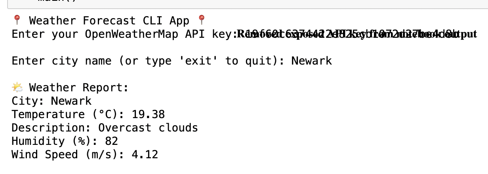

## 📸 Demo Screenshot



# 🌦️ Weather Forecast CLI App using OpenWeatherMap API


This is a simple Python command-line tool built in Jupyter Notebook that fetches current weather data for any city using the OpenWeatherMap API.

## 🧰 Features
- Input any city name
- Get real-time temperature, weather condition, humidity, and wind speed
- Handles API and network errors gracefully
- Lightweight and easy to use

---

## 🛠 Requirements

- Python 3.x
- Jupyter Notebook
- `requests` library

Install required library:
```bash
pip install requests

## 🔐 How to Get an API Key
Go to https://openweathermap.org/api

Create a free account and log in

Visit the API Keys section in your dashboard

Copy your unique API key

## 🚀 How to Run the App
Open the file Weather_Forecast_CLI_App_OpenWeatherMap_API.ipynb in Jupyter Notebook

Run the cells one by one

Paste your API key when prompted

Enter any city name (e.g., Tokyo, Berlin)

View the weather report printed in the output
